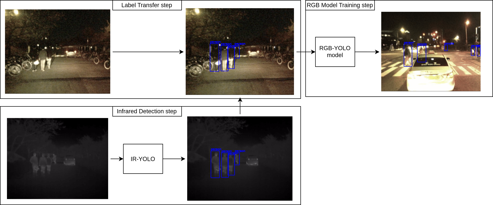

# IR-RGB automated pedestrian labelling pipeline

This repository shows the steps depicted in the reasearch article on "**nighttime pedestrian detection**" submitted to [ITSC-2025](https://ieee-itsc.org/2025/).

# Introduction

The research concerns the process of automatically labelling pedestrians at night specifically aimed for RGB footage. The goal of the research was to provide and evaluate a pipeline that would proove that automated labelling can be performed on nighttime Infrred-RGB image pair for pedestrian detection and that it can yield results equal to those of ground truth labels. For this goal the following steps were taken:

1) **Automated Labelling**: Infrared images were labelled automatically using a fine tuned model for Infrared pedestrian detection.
2) **Label Tranfer**: The generated labels were transferred to the RGB couterparts of the infrared images.
3) **Evaluation**: Using the automatically labelled RGB images a nighttime pedestrian detection model is trained, similarly another model is trained using the ground truth labels provided in KAIST. We then compare and evaluate the two models on Sequence09 of KAIST, a sequqnce they have not trained on and a sequence that covers a wide range of scenarios 

# Baseline Model

For the baseline model of the research [YOLOv11](https://docs.ultralytics.com/models/yolo11/#key-features)[[2]](#2) was chosen. 
All of the steps described were performed with YOLOv11m, l and x to validate the results across a wider range of models.

# Dataset - KAIST [[1]](#1)

The dataset used for the research is the [KAIST dataset](https://soonminhwang.github.io/rgbt-ped-detection/)[[1]](#1). 

### Dataset Preprocessing

KAIST consists of 3 label classes `person`, `people` and `cyclist`. 

the `autolabeller_fine_tunning.ipynb` notebook goes through the fine tunning steps

# Setup 

    $ conda create -n ir_rgb_pedestrian_detection python=3.10.16
    $ conda activate ir_rgb_pedestrian_detection
    $ pip install -r requirements.txt

# Execusion

Fine Tunning a Model for IR Pedestrian Detection:

if you wish to fine tune IR-YOLOm from the start got to `autolabeller_fine_tunning.ipynb` and add your _path_ to the KAIST dataset root, afterwards run the notebook.

If you wish to fine tune your own yolo model add the path to model at `BASELINE_MODEL` variable at the start of the notebook and run the notebook. By default the pipeline should be compatible with any model in the YOLOv11 family.

### Autolabelling Pipeline

In the main.ipynb notebook add the desired fine tuned YOLO model at the top as well as the desired baseline model for the label evaluation

# References

<a id="1">[1]</a>  KAIST dataset [link](https://website.com).

<a id="1">[1]</a> YOLOv11 [link](https://docs.ultralytics.com/models/yolo11/#overview).

